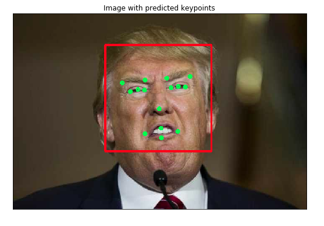

[//]: # (Image References)

[image1]: ./images/obamas_with_keypoints.png "Facial Keypoint Detection"


# AIND Term II, Computer Vision Capstone Project 

## Facial Keypoint Detection and Real-time Filtering

### Project Overview

In this project, we combine knowledge of computer vision techniques and deep learning to build an end-to-end facial keypoint recognition system. Facial key points include points around the eyes, nose, and mouth on any face and are used in many applications, from facial tracking to emotion recognition. Your completed code should be able to take in any image containing faces and identify the location of each face and their facial key points, as shown below.

![Facial Keypoint Detection][image1]

The project will be broken up into a few main parts in one Python notebook:

__Part 1__ : Investigating OpenCV, pre-processing, and face detection.

__Part 2__ : Training a Convolutional Neural Network (CNN) to detect facial key points.

__Part 3__ : Putting parts 1 and 2 together to identify facial key points on any image!


Besides, each part has a real-time demonstration using face detection, eyes detection, and landmark detection using your own camera. Oddly, it was easier to make it run on Windows 10. After installing the necessary libraries and dependencies in my old Macbook, I could not make it run. If you have the chance to test it, you will see that either the face or eyes detections work better when you have a good front view of the face if the person turns the face, the detection is not so good. Give a try and check the limits!!!


### Project Instructions


#### Amazon Web Services

This project requires GPU acceleration to run efficiently. Please refer to the Udacity instructions for setting up a GPU instance for this project, and refer to the project instructions in the classroom for setup. [link for AIND students](https://classroom.udacity.com/nanodegrees/nd889/parts/16cf5df5-73f0-4afa-93a9-de5974257236/modules/53b2a19e-4e29-4ae7-aaf2-33d195dbdeba/lessons/2df3b94c-4f09-476a-8397-e8841b147f84/project)


#### Floydhub 

FloydHub is a platform for training and deploying deep learning models in the cloud. It removes the hassle of launching your own cloud instances and configuring the environment. For example, FloydHub will automatically set up an AWS instance with TensorFlow, the entire Python data science toolkit, and a GPU. Then you can run your scripts or Jupyter notebooks on the instance. For this project:

floyd run --mode jupyter --gpu --env tensorflow-1.0

You can see this project on FloydHub [here](https://www.floydhub.com/nvmoyar/projects/aind-cv-facialkeypoints/jobs). 


#### Local Environment Instructions

1. Clone the repository, and navigate to the downloaded folder.
```
git clone https://github.com/nvmoyar/AIND-CV-FacialKeypoints.git
cd AIND-CV-FacialKeypoints
```

2. Create (and activate) a new environment from the environment.yml file provided in this same repo. Otherwise, if you want to set up a new environment from scratch, you can follow Udacity's directions [here](https://github.com/udacity/AIND-CV-FacialKeypoints). 


### Data

All of the data you'll need to train a neural network is in the AIND-CV-FacialKeypoints at Udacity's repo [here](https://github.com/udacity/AIND-CV-FacialKeypoints/tree/master/data), in the subdirectory `data`. In this folder are a zipped training and test set of data.

1. Navigate to the data directory

```
cd data
```

2. Unzip the training and test data (in that same location). If you are in Windows, you can download this data and unzip it by double-clicking the zipped files. In Mac, you can use the terminal commands below.
```
unzip training.zip
unzip test.zip
```

You should be left with two `.csv` files of the same name. You may delete the zipped files.

Besides, you can download that same training and test data on [Kaggle](https://www.kaggle.com/c/facial-keypoints-detection/data).

#### How the data is arranged

Facial landmarks on this dataset are (x, y) coordinates for: 

* Left and right eyebrows defined by two points each (so, eight values) 
* Left and right eyes defined by three points each eye (so, twelve values)
* Nose (only one point)
* Mouth (four points)

After the 30 columns, you find the image which these coordinate values belong to. 

